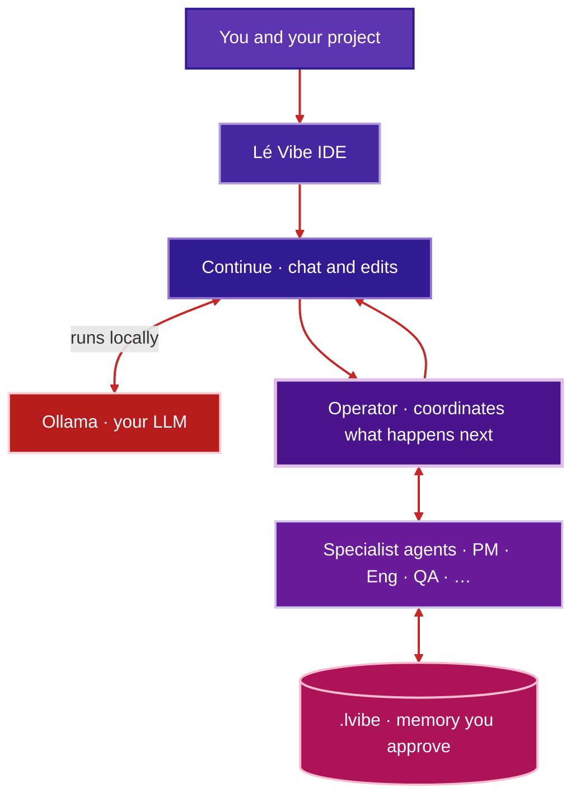
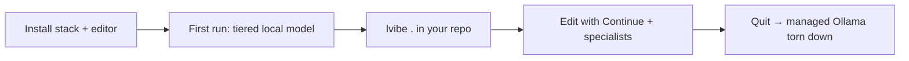
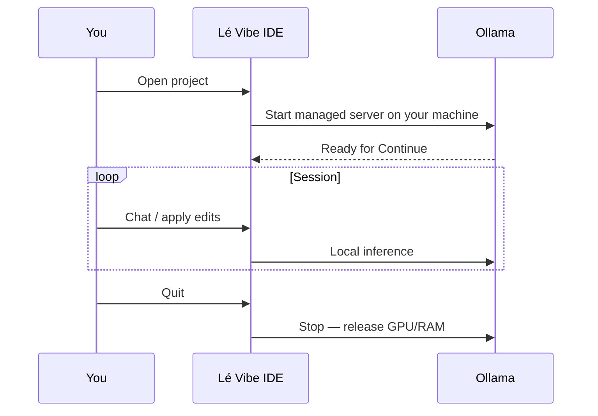

# Lé Vibe

**Lé Vibe** is an **open-source**, **local-first** coding environment: you use a **Code OSS–class editor** (not Microsoft’s “Visual Studio Code” product), talk to your project through the **Continue** extension, and run models on your own machine with **Ollama**. The goal is **Cursor-like intent**—AI-native editing—without locking you to a proprietary cloud or a surprise API bill for the core loop.

What makes it **distinct** is **orchestration**: an **Operator** coordinates the session and **delegates** to **specialist agents** (product, engineering, QA, and other roles). They **collaborate** and store **structured, consent-given** notes under **`.lvibe/`** so work compounds instead of re-scanning the whole repository every turn.

## How orchestration fits together



- **Operator** — one coordinating thread for the session: it decides when to lean on a **specialist** lens instead of one generic assistant for everything.
- **Specialists** — role-shaped agents that **work together**; their outputs land in **`.lvibe/`** (with your **consent** and a **size budget**) so the Operator can **reuse** prior reasoning.
- **Local inference** — **Ollama** uses **your** CPU/GPU. You are not charged per token by a hosted model provider for that path; your tradeoff is **hardware**, **time**, and **honest** model sizing (see [`spec.md`](spec.md)). **Privacy:** defaults keep generation on **localhost**; there is no Lé Vibe–hosted cloud required for the core workflow.

## Target experience (what we’re building)

You install **one** coherent product: a **Lé Vibe** desktop IDE (Code OSS–based), a **managed Ollama** lifecycle tied to the app, **Continue** pre-wired, and **hardware-aware** model selection. You open a folder, get a **welcome** that positions the product honestly, opt into **`.lvibe/`** when you want project memory, and **quit** knowing the heavy **local** workload can **stop** with the session.





**Today:** the **Python stack** ships as a Debian **`.deb`** (**`le-vibe`**). The monorepo also contains **`packaging/debian-le-vibe-ide/`** and **`packaging/scripts/build-le-vibe-ide-deb.sh`** — after you produce **`editor/vscodium/VSCode-linux-*`** (full compile per **[`editor/BUILD.md`](editor/BUILD.md)** §7.3 / optional CI **`linux_compile`** artifact), you get an installable **`le-vibe-ide`** **`.deb`** that exposes **`/usr/lib/le-vibe/bin/codium`** for **`lvibe`**. Until you build that tree, pair the stack with **VSCodium** + **`LE_VIBE_EDITOR`**. See [`editor/README.md`](editor/README.md) and [`spec-phase2.md`](spec-phase2.md) §14.

## Current status

| | |
|--|--|
| **Works well today** | **`lvibe .`**, managed **Ollama** on a **dedicated port** (default **11435**), **Continue** integration, **consent-gated** **`.lvibe/`**, stack **`le-vibe`** **`.deb`**, tests and CI. **IDE `.deb`:** build path **`build-le-vibe-ide-deb.sh`** / **`build-le-vibe-debs.sh --with-ide`** when **`VSCode-linux-*`** exists — **[`packaging/debian-le-vibe-ide/README.md`](packaging/debian-le-vibe-ide/README.md)**; **`build-le-vibe-debs.sh --with-ide`** prints **Full-product install** on success — **[`docs/PM_DEB_BUILD_ITERATION.md`](docs/PM_DEB_BUILD_ITERATION.md)** (*Success output (`--with-ide`)*); **preflight (optional):** **`lvibe ide-prereqs --print-closeout-commands`** ( **`packaging/scripts/probe-vscode-linux-build.sh`**, preflight, verify lines) or **`packaging/scripts/preflight-step14-closeout.sh --require-stack-deb`** — **[`le-vibe/README.md`](le-vibe/README.md)** *Production install*; close-out gate: **`packaging/scripts/verify-step14-closeout.sh --require-stack-deb`** (optional **`--apt-sim`**, **`--json`**; **`vscode_linux_build`** + **`apt_sim_note`** — **[`docs/PM_DEB_BUILD_ITERATION.md`](docs/PM_DEB_BUILD_ITERATION.md)** (*`--json` close-out payload*); **`lvibe ide-prereqs --json`** uses the same **`vscode_linux_build`** field for **14.c** state). **Ordering:** **build machine** close-out, **test host** install/smoke — **[`docs/apt-repo-releases.md`](docs/apt-repo-releases.md)** (*IDE package*). **Compile fail-fast:** **`packaging/scripts/ci-vscodium-bash-syntax.sh`** → **`packaging/scripts/ci-editor-nvmrc-sync.sh`** → **`packaging/scripts/ci-vscodium-linux-dev-build.sh`** (same as **`./editor/smoke.sh`** / **`linux_compile`**) — **[`docs/apt-repo-releases.md`](docs/apt-repo-releases.md)** (*IDE package*), **[`docs/PM_DEB_BUILD_ITERATION.md`](docs/PM_DEB_BUILD_ITERATION.md)** (*Compile fail-fast*). **Partial VSCode-linux triage** — **[`editor/BUILD.md`](editor/BUILD.md)** (*Partial tree*), **[`docs/PM_DEB_BUILD_ITERATION.md`](docs/PM_DEB_BUILD_ITERATION.md)** (*Partial VSCode-linux tree*), **`./editor/print-built-codium-path.sh`**, **`./editor/print-vsbuild-codium-path.sh`**, **`./packaging/scripts/print-step14-vscode-linux-bin-files.sh`** (**`--help`**; same **`bin/`** list as **`lvibe ide-prereqs --json`** **`vscode_linux_bin_files`**), **`./packaging/scripts/build-le-vibe-ide-deb.sh --help`**. |
| **In progress** | **Published apt** channel / release cadence for both **`.deb`** packages, fuller first-run polish, **optional** green **`linux_compile`** on default GitHub-hosted runners, broader OS packaging. |
| **Feedback** | **GitHub Issues** in this repository. Clone with **`git clone --recurse-submodules`** so **`editor/vscodium`** is present for [`./editor/smoke.sh`](editor/smoke.sh). If you already cloned without submodules, run **`git submodule update --init editor/vscodium`** from the repo root — [`editor/README.md`](editor/README.md) *Fresh clone (14.b)*. |

### Limitations (snapshot)

- Not the **Visual Studio Code** trademarked product; editor lineage is **Code - OSS** / **VSCodium**.
- **Default PR CI** does **not** upload a pre-built **Lé Vibe** Electron **`.deb`** — produce **`VSCode-linux-*`** locally or via optional **`linux_compile`**, then **`packaging/scripts/build-le-vibe-ide-deb.sh`** (**[`editor/BUILD.md`](editor/BUILD.md)**). Interim: **VSCodium** + **`LE_VIBE_EDITOR`**.
- **First run** can be slow (Ollama install, **model pull**); **Linux** is the primary packaging focus for now.

## Repository layout

| Path | Role |
|------|------|
| **`le-vibe/`** | Python package: bootstrap, **`lvibe`** launcher, tests, Continue / **`.lvibe/`** integration |
| **`debian/`**, **`packaging/`** | Stack **`.deb`** and launchers |
| **`editor/`** | **Lé Vibe IDE** — **`vscodium/`** ([VSCodium](https://github.com/VSCodium/vscodium) submodule), **`le-vibe-overrides/`** — see [`docs/vscodium-fork-le-vibe.md`](docs/vscodium-fork-le-vibe.md) |

## Learn more

| Doc | Why read it |
|-----|-------------|
| [`docs/PRODUCT_SPEC.md`](docs/PRODUCT_SPEC.md) | Must-ship behavior: **`lvibe`**, **`.lvibe/`**, welcome, secrets |
| [`spec.md`](spec.md) | Bootstrap and **hardware-aware** model tiers |
| [`spec-phase2.md`](spec-phase2.md) | IDE product direction and **§14** in-repo snapshot |
| [`docs/README.md`](docs/README.md) | Full doc index (**Roadmap H1–H8**), maintainer entry points |
| [`SECURITY.md`](SECURITY.md) | Reporting vulnerabilities |

Diagram **color accents** used in this README are documented as a **reference palette** in [`docs/brand-assets.md`](docs/brand-assets.md) (not a promise of shipped UI theming).

<details>
<summary><strong>Developer & maintainer reference</strong> (install, APIs, CI, orchestration details)</summary>

### Prioritization (what ships first)

**P0 — Desktop IDE:** Implement **`editor/`** — branded **Lé Vibe** Code - OSS binary (Roadmap **H6**): name, icons, About, installable artifact from **this** repo. See **[`editor/README.md`](editor/README.md)** and **[`docs/vscodium-fork-le-vibe.md`](docs/vscodium-fork-le-vibe.md)**.

**P1 — Stack:** **`lvibe`**, managed Ollama, **`le-vibe`** **`.deb`**, Continue + **`.lvibe/`** — shared config under **`~/.config/le-vibe/`**, **`LE_VIBE_EDITOR`** points at the IDE binary.

**PM / project management:** Epics, session manifests, and lazy prompts **coordinate delivery of the IDE + stack**—see **[`docs/PRODUCT_SPEC.md`](docs/PRODUCT_SPEC.md)** *Product and project management — in service of the IDE* and **[`docs/PROMPT_BUILD_LE_VIBE.md`](docs/PROMPT_BUILD_LE_VIBE.md)** (orchestrator order **0→1→14→…**).

**Interim dev:** **`editor/vscodium`** vendors **VSCodium** upstream (git submodule). For a **demo install** of the branded shell: compile **`VSCode-linux-*`**, run **`packaging/scripts/build-le-vibe-ide-deb.sh`** (or **`packaging/scripts/build-le-vibe-debs.sh --with-ide`**), run **`packaging/scripts/verify-step14-closeout.sh --require-stack-deb`** (optional **`--apt-sim`**, **`--json`**; **`apt_sim_note`** — **[`docs/PM_DEB_BUILD_ITERATION.md`](docs/PM_DEB_BUILD_ITERATION.md)** (*`--json` close-out payload*)), then install both **`.deb`** files from the same directory on a **test host**, e.g. **`sudo apt install ./le-vibe_*_all.deb ./le-vibe-ide_*_amd64.deb`** — details in **`packaging/debian-le-vibe-ide/README.md`** (*Install both packages*). **Ordering:** close-out on the **build machine** where the **`.deb`** files were produced; post-install smoke — **[`packaging/scripts/manual-step14-install-smoke.sh`](packaging/scripts/manual-step14-install-smoke.sh)** — **[`docs/apt-repo-releases.md`](docs/apt-repo-releases.md)** (*IDE package*). Until that build exists on your machine, use system **VSCodium** + **`LE_VIBE_EDITOR`** alongside the **`le-vibe`** **`.deb`**. One **git** history in this monorepo; release tags can cover **stack + IDE** drops together.

### Lé Vibe IDE — STEP 14 / H6 (**[`docs/PRODUCT_SPEC.md`](docs/PRODUCT_SPEC.md)** §7.3)

**Master orchestrator STEP 14** (H6 — **[`docs/PM_STAGE_MAP.md`](docs/PM_STAGE_MAP.md)**): ship a **branded** Code - OSS shell and an **installable IDE** **`.deb`** from this monorepo — **[`editor/README.md`](editor/README.md)**, **[`docs/vscodium-fork-le-vibe.md`](docs/vscodium-fork-le-vibe.md)**; product merge + Linux assets via **`editor/le-vibe-overrides/`** (**[`editor/le-vibe-overrides/branding-staging.checklist.md`](editor/le-vibe-overrides/branding-staging.checklist.md)** — fast **`./editor/smoke.sh`** / **`ci-editor-gate.sh`** ≠ full on-disk **§7.3** branding). **Public CLI** remains **only `lvibe`** on **PATH** (**§7.3**); IDE packaging uses internal paths such as **`/usr/lib/le-vibe/bin/codium`**. **Debian:** **[`packaging/debian-le-vibe-ide/`](packaging/debian-le-vibe-ide/)** — build with **`packaging/scripts/build-le-vibe-ide-deb.sh`** or **`packaging/scripts/build-le-vibe-debs.sh --with-ide`** after **`editor/vscodium/VSCode-linux-*`** exists. **Compile fail-fast** (same as **`./editor/smoke.sh`** / **`linux_compile`):** **`packaging/scripts/ci-vscodium-bash-syntax.sh`** → **`packaging/scripts/ci-editor-nvmrc-sync.sh`** → **`packaging/scripts/ci-vscodium-linux-dev-build.sh`** → **`dev/build.sh`** (**`LEVIBE_SKIP_NODE_VERSION_CHECK`** escape hatch — **`editor/BUILD.md`** *CI*). **Close-out:** **`packaging/scripts/verify-step14-closeout.sh --require-stack-deb`**; **preflight:** **`packaging/scripts/preflight-step14-closeout.sh`**, **`lvibe ide-prereqs --print-closeout-commands`**. **GitHub Actions** (**[`build-le-vibe-ide.yml`](.github/workflows/build-le-vibe-ide.yml)** optional **`linux_compile`**) are **not** a v1 **“STEP 14 done”** gate (**§7.3**). Tests **`test_editor_readme_step14_contract.py`**, **`test_verify_step14_closeout_contract.py`**, **`test_build_le_vibe_ide_workflow_contract.py`**, **`test_editor_le_vibe_overrides_readme_contract.py`**. Package README: **[`le-vibe/README.md`](le-vibe/README.md)** *Production install (STEP 14 / §7.3)*.

## Managed Ollama (dedicated port, §7.2-A)

Lé Vibe’s managed `ollama serve` uses a **dedicated localhost port** so quit/teardown does not kill unrelated Ollama users on the default port:

- Default **managed port:** `11435` (constant `LE_VIBE_MANAGED_OLLAMA_PORT` in `le_vibe/paths.py`).
- **State file:** `~/.config/le-vibe/managed_ollama.json` (PID, host, port, session id).
- **Continue `apiBase`** must match, e.g. `http://127.0.0.1:11435` — produced when you run bootstrap with `--le-vibe-product` (writes configs under `~/.config/le-vibe/`).

On **last-window quit**, the launcher sends **SIGTERM** to the managed process group, waits, then **SIGKILL** if needed, and removes the state file — **VRAM and RAM used by inference are released** when you exit Lé Vibe.

### Model policy (must-ship)

Lé Vibe picks a **concrete Ollama model tag** for **this machine** using the hardware **tier** ladder (RAM, VRAM, disk—honest limits, no “always 70B” marketing). The chosen tag is **persisted** as the product lock so upgrades do not silently change your default: see **`~/.config/le-vibe/locked-model.json`** (and **`model-decision.json`** for rationale). Continue’s generated YAML uses that same tag—**not** `AUTODETECT` as the only stored value when a tag is known.

### PM session manifest — STEP 2 (workspace `.lvibe/`)

**Master orchestrator STEP 2** (queue order **0 → 1 → 14 → 2 → …** — **[`docs/PROMPT_BUILD_LE_VIBE.md`](docs/PROMPT_BUILD_LE_VIBE.md)**; stage map **[`docs/PM_STAGE_MAP.md`](docs/PM_STAGE_MAP.md)**): on workspace prepare (e.g. **`lvibe .`**), after **consent** for local workspace memory ([**`docs/PRODUCT_SPEC.md`**](docs/PRODUCT_SPEC.md) §5), Lé Vibe seeds **`.lvibe/session-manifest.json`** from the canonical example (prefer **[`schemas/session-manifest.v1.example.json`](schemas/session-manifest.v1.example.json)** in a clone via **`session_manifest_example_source_path`**, else the bundled copy) when missing, and copies skill agents into **`.lvibe/agents/<agent_id>/skill.md`** from **`le-vibe/templates/agents/`** when each file is missing. The Python API exposes **`session_steps`**, **`product.epics` / tasks** iteration (**`iter_tasks_in_epic_order`**), and **`apply_opening_skip(...)`** / **`lvibe apply-opening-skip`** for the **opening_intent → skip → workspace_scan** hook in **[`docs/SESSION_ORCHESTRATION_SPEC.md`](docs/SESSION_ORCHESTRATION_SPEC.md)** (`le_vibe.session_orchestrator`). Package README: **[`le-vibe/README.md`](le-vibe/README.md)** *PM session*.

### Continue workspace rules — STEP 3 / E2

**Master orchestrator STEP 3** (E2 — **[`docs/PM_STAGE_MAP.md`](docs/PM_STAGE_MAP.md)**): after **`le-vibe-setup-continue`** (global **`~/.continue/config.yaml`** → Lé Vibe YAML), the assistant still needs **project** context. Lé Vibe writes **`.continue/rules/`** on first workspace prepare—**`00-le-vibe-lvibe-memory.md`** (primary memory: **`.lvibe/`**, **`session-manifest.json`**, **`agents/*/skill.md`**) and **`01-le-vibe-product-welcome.md`** (short §4 positioning for Chat/Agent)—per **[Continue rules](https://docs.continue.dev/customize/rules)**. Implementation **`le_vibe.continue_workspace`**; **`lvibe continue-rules`** seeds the same files without launching the editor. Agent skill refresh: **`lvibe sync-agent-skills`** (or **[`packaging/scripts/sync-lvibe-agent-skills.sh`](packaging/scripts/sync-lvibe-agent-skills.sh)**). Package README: **[`le-vibe/README.md`](le-vibe/README.md)** *Continue (STEP 3 / E2)*.

### In-editor welcome — STEP 4 / E3

**Master orchestrator STEP 4** (E3): **[`docs/PRODUCT_SPEC.md`](docs/PRODUCT_SPEC.md) §4** — **Welcome to Lé Vibe**, open/free, local-first vs **Cursor** (intent, not parity). **Surfaces:** (1) **`.lvibe/WELCOME.md`** — full paragraph for humans (**Explorer** / **Quick Open**); seeded on workspace prepare from **`le-vibe/templates/lvibe-editor-welcome.md`** (`le_vibe.editor_welcome`). (2) **`.continue/rules/01-le-vibe-product-welcome.md`** — same positioning for Continue (**`alwaysApply`**). The **terminal** may still print a one-time banner on first launch; §4 **running** copy is the markdown + rule. **CLI:** **`lvibe welcome`** (path or **`--text`**) and **`lvibe open-welcome`** (open in the resolved editor) — **[`le-vibe/README.md`](le-vibe/README.md)** *In-editor welcome (STEP 4 / E3)*; tests **`test_editor_welcome.py`**, **`test_continue_workspace.py`**.

### Please continue & AI Pilot (§7.1)

- **Please continue** — Resume construction from the **current** PM state: **`.lvibe/session-manifest.json`** (`session_steps`, **`product.epics`** / tasks) and **`.lvibe/`** RAG—not a blank restart. Intent and guards: **[`docs/AI_PILOT_AND_CONTINUE.md`](docs/AI_PILOT_AND_CONTINUE.md)**.
- **AI Pilot** — Sustained, coordinated advancement (mimicked in Cursor by re-pasting the **self-coordinating engineer** loop in **[`docs/PROMPT_BUILD_LE_VIBE.md`](docs/PROMPT_BUILD_LE_VIBE.md)**). **§5** consent/storage and **§8** secrets still apply; doc authority per stage: **[`docs/PM_STAGE_MAP.md`](docs/PM_STAGE_MAP.md)**.

### User gate (§7.2)

On **material** product or architecture choices—or **unresolved disagreement** between roles—the orchestrator **halts** and shows **`USER RESPONSE REQUIRED`** (all capitals) with **numbered questions**; **No preference** / **your call** counts as delegation. Protocol: **[`docs/PRODUCT_SPEC.md`](docs/PRODUCT_SPEC.md)** §7.2, **[`docs/SESSION_ORCHESTRATION_SPEC.md`](docs/SESSION_ORCHESTRATION_SPEC.md)** §5.1. Workspace rules under **`.continue/rules/`** restate this for Continue.

### Maintainer hygiene — STEP 5 / E4 (`lvibe-hygiene`)

**Master orchestrator STEP 5** (E4 — **[`docs/PM_STAGE_MAP.md`](docs/PM_STAGE_MAP.md)**): validate **`.lvibe/`** layout for PM manifests and RAG hygiene (**[`docs/PRODUCT_SPEC.md`](docs/PRODUCT_SPEC.md)** §5). Run from the **workspace root** when **`.lvibe/`** exists (after **`lvibe .`** with **§5** consent **accept**): **`lvibe-hygiene`** (on `PATH` from the `.deb`) or **`python3 -m le_vibe.hygiene`** with **`PYTHONPATH`** set to the **`le-vibe/`** tree in development.

**Checks:** **`manifest.yaml`** sanity; **`session-manifest.json`** (**`session-manifest.v1`** vs **[`schemas/session-manifest.v1.example.json`](schemas/session-manifest.v1.example.json)**); manifest **`skill_path`** entries under **`agents/`**; **`path:`** references in **`.lvibe/chunks/`** and **`.lvibe/rag/`**; optional **`storage-state.json`** (**`lvibe-storage-state.v1`** — §5.4 usage vs cap); large **`memory/incremental.md`** warning.

**Flags:** **`--seed-missing`** — copy missing **`session-manifest.json`** and agent **`skill.md`** files from templates (same as workspace prepare; idempotent). **`--json`** — machine-readable **`errors`** / **`warnings`** (and optional **`seed`** lines).

Exit **0** = no errors (warnings may print to **stderr**), **1** = validation errors. Implementation **`le_vibe.hygiene`**; tests **`test_hygiene.py`**. Package README: **[`le-vibe/README.md`](le-vibe/README.md)** *Maintainer hygiene (STEP 5 / E4)*.

### Continue extension pin — STEP 7 / H4 (Roadmap H4)

**Master orchestrator STEP 7** (H4 — **[`docs/PM_STAGE_MAP.md`](docs/PM_STAGE_MAP.md)**): reproducible **Continue** installs via Open VSX **`continue.continue@<semver>`**. Single source of truth **[`packaging/continue-openvsx-version`](packaging/continue-openvsx-version)**; **`packaging/scripts/install-continue-extension.sh`** consumes it (also **`/usr/share/le-vibe/continue-openvsx-version`** after **`dpkg -i`**). Validate with **`packaging/scripts/verify-continue-pin.sh`** (runs from **`ci-smoke.sh`** before **`pytest`**). Authority **[`docs/continue-extension-pin.md`](docs/continue-extension-pin.md)** (**§14.h** table when **`LE_VIBE_EDITOR`** points at a local **`codium`**). Tests **`test_continue_openvsx_pin.py`**. Package README: **[`le-vibe/README.md`](le-vibe/README.md)** *Continue / Open VSX pin (STEP 7 / H4)*.

### Releases & checksums — STEP 8 / H1 (Roadmap H1)

**Master orchestrator STEP 8** (H1 — **[`docs/PM_STAGE_MAP.md`](docs/PM_STAGE_MAP.md)** *H1 vs §7.3 .deb bundles*): stack releases use **GitHub Actions** artifact **`le-vibe-deb`** — **`le-vibe`** **`.deb`**, SBOM **`le-vibe-python.cdx.json`**, **`SHA256SUMS`** (CI runs **`sha256sum -c`** before upload). **IDE** **`le-vibe-ide_*_amd64.deb`** is **not** in default CI — ship beside the stack **`.deb`** when you build §7.3 (**[`docs/apt-repo-releases.md`](docs/apt-repo-releases.md)** *IDE package*). Local verify: **`lvibe verify-checksums`**. Versioning: **`debian/changelog`**, **[`CHANGELOG.md`](CHANGELOG.md)**. Tests **`test_apt_repo_releases_doc_h1_contract.py`**, **`test_pm_stage_map_step8_contract.py`**. Workflow **[`.github/workflows/ci.yml`](.github/workflows/ci.yml)**. Package README: **[`le-vibe/README.md`](le-vibe/README.md)** *Release channel / checksums (STEP 8 / H1)*.

### Supply chain & SBOM — STEP 9 / H2 (Roadmap H2)

**Master orchestrator STEP 9** (H2 — **[`docs/PM_STAGE_MAP.md`](docs/PM_STAGE_MAP.md)**): Python stack **pins** (**[`le-vibe/requirements.txt`](le-vibe/requirements.txt)**), **`pip-audit`** (OSV), and **CycloneDX** **`le-vibe-python.cdx.json`** (in **`le-vibe-deb`** / **`SHA256SUMS`**). CI **Python supply chain (H2)** in **[`.github/workflows/ci.yml`](.github/workflows/ci.yml)**; weekly bumps — **[`.github/dependabot.yml`](.github/dependabot.yml)**. Signing / maintainer story — **[`docs/sbom-signing-audit.md`](docs/sbom-signing-audit.md)** (**§14** honesty: H6/H7 have separate SBOM needs). Tests **`test_sbom_signing_audit_doc_h2_contract.py`**, **`test_requirements_pins.py`**, **`test_pm_stage_map_step9_contract.py`**. Package README: **[`le-vibe/README.md`](le-vibe/README.md)** *Supply chain / SBOM (STEP 9 / H2)*.

### QA CI & smoke — STEP 10 / H3 (Roadmap H3)

**Master orchestrator STEP 10** (H3 — **[`docs/PM_STAGE_MAP.md`](docs/PM_STAGE_MAP.md)**): **[`packaging/scripts/ci-smoke.sh`](packaging/scripts/ci-smoke.sh)** (**`verify-continue-pin`**, full **`pytest`**, **`ci-editor-gate.sh`** — same fast gate as **[`./editor/smoke.sh`](editor/smoke.sh)**), **`desktop-file-validate`**, **`dpkg-buildpackage`**, **`lintian`** — see **[`docs/ci-qa-hardening.md`](docs/ci-qa-hardening.md)** (**14.e / 14.f** *Optional full Linux compile*, IDE smoke vs **`linux_compile`**). **`lvibe ci-smoke`** / **`lvibe ci-editor-gate`** wrap the same scripts (**`LE_VIBE_REPO_ROOT`**). Tests **`test_ci_qa_hardening_doc_h3_contract.py`**, **`test_pm_stage_map_step10_contract.py`**, **`test_docs_readme_ci_qa_hardening_row_contract.py`**. Workflow **[`.github/workflows/ci.yml`](.github/workflows/ci.yml)** — detail in **[## CI](#ci)** below. Package README: **[`le-vibe/README.md`](le-vibe/README.md)** *QA CI (STEP 10 / H3)*.

### Brand & screenshots — STEP 11 / H5 (Roadmap H5)

**Master orchestrator STEP 11** (H5 — **[`docs/PM_STAGE_MAP.md`](docs/PM_STAGE_MAP.md)**): **[`docs/brand-assets.md`](docs/brand-assets.md)** — **Lé Vibe** naming (é), **`hicolor`** app icon **[`packaging/icons/hicolor/scalable/apps/le-vibe.svg`](packaging/icons/hicolor/scalable/apps/le-vibe.svg)**, screenshot conventions **[`docs/screenshots/README.md`](docs/screenshots/README.md)**. **`lvibe brand-paths`** resolves SVG paths (**`--json`** for automation). Tests **`test_brand_assets_doc_h5_contract.py`**, **`test_pm_stage_map_step11_contract.py`**. Package README: **[`le-vibe/README.md`](le-vibe/README.md)** *Brand assets (STEP 11 / H5)*.

### Product surface — STEP 12 / H8 (Roadmap H8)

**Master orchestrator STEP 12** (H8 — **[`docs/PM_STAGE_MAP.md`](docs/PM_STAGE_MAP.md)**): **`.github/`** — **[`.github/workflows/ci.yml`](.github/workflows/ci.yml)** (stack **`le-vibe-deb`**, **`ci-smoke.sh`**, **`pip-audit`**, CycloneDX SBOM, **lintian**), **[`.github/dependabot.yml`](.github/dependabot.yml)** (weekly **pip** + **GitHub Actions** bumps), **[`.github/ISSUE_TEMPLATE/`](.github/ISSUE_TEMPLATE/)** (**[`config.yml`](.github/ISSUE_TEMPLATE/config.yml)** **`#` H8** maintainer lines — **STEP 12** anchors). Reporter-facing intros tie **Roadmap H8** to **[`docs/README.md`](docs/README.md)** *Product surface*, **[`docs/privacy-and-telemetry.md`](docs/privacy-and-telemetry.md)** (*E1 contract tests*), **[`SECURITY.md`](SECURITY.md)** *Related docs*, and optional **[`docs/rag/le-vibe-phase2-chunks.md`](docs/rag/le-vibe-phase2-chunks.md)**. Optional IDE workflows — **[`.github/workflows/build-le-vibe-ide.yml`](.github/workflows/build-le-vibe-ide.yml)** / **[`.github/workflows/build-linux.yml`](.github/workflows/build-linux.yml)** (**§14** honesty — not a v1 production gate per **§7.3**). Tests **`test_issue_template_h8_contract.py`**, **`test_pm_stage_map_step12_contract.py`**. **`lvibe product-surface`** lists monorepo paths (**`--json`**). Package README: **[`le-vibe/README.md`](le-vibe/README.md)** *Trust / H8 — product surface (STEP 12)*.

### Flatpak & AppImage — STEP 13 / H7 (Roadmap H7)

**Master orchestrator STEP 13** (H7 — **[`docs/PM_STAGE_MAP.md`](docs/PM_STAGE_MAP.md)**): in-tree **alternate** Linux bundles for the **Python stack** + **`lvibe`** — **[`docs/flatpak-appimage.md`](docs/flatpak-appimage.md)**; **[`packaging/flatpak/org.le_vibe.Launcher.yml`](packaging/flatpak/org.le_vibe.Launcher.yml)** (rough **Flathub** track); **[`packaging/appimage/`](packaging/appimage/)** (**`AppRun`**, **`build-appimage.sh`**). **Baseline** ship remains the **native `.deb`**; **H7** does **not** compile the **Lé Vibe IDE** (**H6** / **STEP 14** — **[`editor/`](editor/)**). Honesty — **[`spec-phase2.md`](spec-phase2.md) §14**. **`lvibe flatpak-appimage`** exposes paths (**`--json`**). Tests **`test_flatpak_appimage_doc_h7_contract.py`**, **`test_pm_stage_map_step13_contract.py`** (**`pytest`** does not build bundles). Package README: **[`le-vibe/README.md`](le-vibe/README.md)** *Alternate packages / Flatpak & AppImage (STEP 13 / H7)*.

### `.lvibe/` governance — STEP 15 (**[`docs/PRODUCT_SPEC.md`](docs/PRODUCT_SPEC.md)** §5.1–5.6)

**Master orchestrator STEP 15** (governance — **[`docs/PM_STAGE_MAP.md`](docs/PM_STAGE_MAP.md)**): consent **before** creating **`.lvibe/`** (decline → no folder; persist opt-out); **50 MB** default storage cap (user-set); per-agent **`agents/<agent_id>/`** + shared **`rag/`**; compaction at cap (**§5.5** order). **`prepare_workspaces_for_editor_args`** gates **`ensure_lvibe_workspace`** via **`resolve_lvibe_creation`**. **`lvibe workspace-governance`** (**`-C`** / **`--workspace`**, **`--json`**) surfaces consent, cap, and usage. Tests **`test_workspace_consent.py`**, **`test_workspace_storage.py`**, **`test_workspace_hub.py`**, **`test_pm_stage_map_step15_contract.py`**. Package README: **[`le-vibe/README.md`](le-vibe/README.md)** *`.lvibe/` governance (STEP 15)*.

### PM stage map — STEP 16 (doc-locked loop)

**Master orchestrator STEP 16** — **[`docs/PM_STAGE_MAP.md`](docs/PM_STAGE_MAP.md)** (this file): Master queue **0–17** ↔ primary PM doc per stage; **`docs/PROMPT_BUILD_LE_VIBE.md`** fence + **`packaging/scripts/print-master-orchestrator-prompt.py`** (**`lvibe master-orchestrator --print`** / **`--json`**). Keep **[`docs/README.md`](docs/README.md)** and root **`README.md`** linked. Tests **`test_prompt_build_orchestrator_fence.py`**, **`test_pm_stage_map_step16_contract.py`**.

### AI Pilot & Continue contracts — STEP 17

**Master orchestrator STEP 17** (contracts — **[`docs/PM_STAGE_MAP.md`](docs/PM_STAGE_MAP.md)**): **[`docs/AI_PILOT_AND_CONTINUE.md`](docs/AI_PILOT_AND_CONTINUE.md)** — **Please continue** / **AI Pilot** mimic, doc-first staging, **§8** secrets discipline. Product copy also under **Please continue & AI Pilot (§7.1)** earlier in this README; Continue rules from **`le_vibe.continue_workspace`**. Tests **`test_root_readme_ai_pilot_contract.py`**, **`test_pm_stage_map_step17_contract.py`**, **`test_privacy_and_ai_pilot_prioritization_cargo_contract.py`**. Package README: **[`le-vibe/README.md`](le-vibe/README.md)** *AI Pilot & Continue contracts (STEP 17)*.

## Install (development tree)

```bash
cd le-vibe
pip install -r requirements.txt
```

**Phase 1–style bootstrap** (default Ollama port `11434`, outputs under `le-vibe/output/`):

```bash
python3 bootstrap.py --yes
```

**Lé Vibe product paths** (configs + model decision under `~/.config/le-vibe/`, managed port **11435**):

```bash
python3 bootstrap.py --yes --le-vibe-product
```

**Launcher** (starts managed Ollama, then your editor; stops Ollama on exit):

```bash
# After install — open the editor in the current folder (default CLI name: lvibe):
lvibe .

# From repo `le-vibe/` tree:
./scripts/le-vibe-launch.sh --editor codium
# or
export PYTHONPATH="$PWD"
python3 -m le_vibe.launcher --editor /path/to/code-oss
```

Set **`LE_VIBE_EDITOR`** to the Code - OSS / VSCodium binary if you do not pass `--editor`.

### First-run (production path)

On **first launch**, `le_vibe.launcher` runs **`ensure_product_first_run`** (unless `--skip-first-run`): Ollama install if needed, hardware tier, **model pull** (can take a long time), writes `~/.config/le-vibe/continue-config.yaml` and marks **`~/.config/le-vibe/.first-run-complete`**. Later launches skip that step and only start managed Ollama.

- **`LE_VIBE_ASSUME_YES`** — default `1` for non-interactive install hints; set to `0` if you need interactive Ollama installers.
- **`LE_VIBE_VERBOSE`** — set to `1` for debug logging during first-run.
- **`--force-first-run`** — re-run bootstrap even if the marker exists (launcher).
- **Continue (one command after first-run):** with VSCodium installed, run **`le-vibe-setup-continue`** (on `PATH` from the `.deb`, or `packaging/bin/le-vibe-setup-continue` in a dev tree). It runs **sync** then **extension install** with explicit exit codes:
  - **0** — success  
  - **1** — no `~/.config/le-vibe/continue-config.yaml` yet (run **`le-vibe`** first)  
  - **2** — config sync failed  
  - **3** — extension install failed (network / marketplace / id)  
  - **4** — no editor binary (`LE_VIBE_EDITOR` / `codium`)  
  - **125** — unknown CLI option (see **`--help`**)  
  - **127** — helper scripts missing, or **`--gui`** without **zenity** on `PATH`  

  Optional **desktop prompt (Roadmap G-A2):** after first-run, **`le-vibe-setup-continue --gui`** uses **Zenity** (install `zenity` or use the package `Suggests`) to confirm before syncing and installing the extension; cancel exits **0**.

  Optional **one-shot reminder (Roadmap G-A3):** the package installs **`/etc/xdg/autostart/le-vibe-continue-setup.desktop`**, which runs once per user (after `~/.config/le-vibe/continue-config.yaml` exists and **`~/.continue/config.yaml`** is not yet linked) and sends a **`notify-send`** hint if **`libnotify-bin`** is installed. Opt out permanently: **`touch ~/.config/le-vibe/.continue-setup-autostart-disable`**, or disable the entry in your session’s autostart settings.

  Advanced: run [`packaging/scripts/sync-continue-config.sh`](packaging/scripts/sync-continue-config.sh) and [`packaging/scripts/install-continue-extension.sh`](packaging/scripts/install-continue-extension.sh) separately; default extension id **`continue.continue`**. **Roadmap H4:** pin file **[`packaging/continue-openvsx-version`](packaging/continue-openvsx-version)** + validator **[`packaging/scripts/verify-continue-pin.sh`](packaging/scripts/verify-continue-pin.sh)** (also enforced by pytest + CI smoke). Override with **`LE_VIBE_CONTINUE_OPENVSX_VERSION=latest`** or **`LE_VIBE_CONTINUE_EXTENSION`** — see **[`docs/continue-extension-pin.md`](docs/continue-extension-pin.md)**.

## Python API (importable)

```python
from le_vibe import (
    EnsureBootstrapArgs,
    ensure_bootstrap,
    ensure_managed_ollama,
    ensure_product_first_run,
    stop_managed_ollama,
    le_vibe_config_dir,
    LE_VIBE_MANAGED_OLLAMA_PORT,
)

# First-run / installer (or call ensure_product_first_run() wrapper).
code, state = ensure_bootstrap(
    EnsureBootstrapArgs(
        port=LE_VIBE_MANAGED_OLLAMA_PORT,
        config_dir=le_vibe_config_dir(),
        yes=True,
        use_managed_ollama=True,
    )
)

# Each app session: start managed server only for Lé Vibe.
ok, msg, st = ensure_managed_ollama()
# On quit:
stop_managed_ollama()
```

## Debian package (stack)

The `debian/` and `packaging/` trees build a native **`.deb`** that installs the Python stack under `/usr/share/le-vibe` and launchers such as `/usr/bin/lvibe`. The **Lé Vibe–branded Electron/Code OSS binary** is **not** bundled in this package; install **VSCodium** (or set **`LE_VIBE_EDITOR`**) until **`editor/`** release builds ship per **[`editor/README.md`](editor/README.md)**.

Editor check for CI/smoke [`packaging/scripts/fetch-code-oss-artifact.sh`](packaging/scripts/fetch-code-oss-artifact.sh): **exits 0** if **`/usr/bin/codium`** is executable or **`codium`** is on `PATH`; otherwise prints install hints and exits 1. The launcher defaults to **`/usr/bin/codium`** when that file exists (override with **`LE_VIBE_EDITOR`**).

```bash
# From repository root (with build tools: debhelper, dpkg-dev, fakeroot)
dpkg-buildpackage -us -uc -b
```

After install, **`man le-vibe`** and **`man le-vibe-setup-continue`** document the launcher and Continue setup (both ship in the `.deb`).

**Flatpak / AppImage (Roadmap H7):** In-tree templates — **[`packaging/flatpak/org.le_vibe.Launcher.yml`](packaging/flatpak/org.le_vibe.Launcher.yml)** (rough target **Flathub**) and **[`packaging/appimage/`](packaging/appimage/)** — are **not** built in default CI; see **[`docs/flatpak-appimage.md`](docs/flatpak-appimage.md)** (sandbox, Ollama, editor **`LE_VIBE_EDITOR`**).

## CI

On **GitHub**, pushes and PRs to `main` / `master` run [`.github/workflows/ci.yml`](.github/workflows/ci.yml) (**checkout** fetches **`editor/vscodium`** via **`submodules: recursive`**): **[`packaging/scripts/ci-smoke.sh`](packaging/scripts/ci-smoke.sh)** (full **`le-vibe/tests/`** **`pytest`**, incl. **`test_issue_template_h8_contract.py`** for **H8** / **STEP 12**; then **`ci-editor-gate.sh`** — **H6** layout / **`bash -n`** / **`editor/.nvmrc`** — same gate as **`./editor/smoke.sh`**; then **`desktop-file-validate`**), **`dpkg-buildpackage`**, **lintian** (**fails on policy errors**), supply-chain steps, and upload of the built **`.deb`** and related artifacts. You can also run the workflow **manually** (**Actions → CI → Run workflow**). Overlapping runs on the same branch cancel in progress (concurrency). The job **times out after 30 minutes** to avoid stuck runners.

**Lé Vibe IDE (Roadmap H6, STEP 14):** default **CI** does **not** compile the **Electron** editor on every **PR**, but it **does** run the vendoring smoke above via **`ci-smoke.sh`**. **[`build-le-vibe-ide.yml`](.github/workflows/build-le-vibe-ide.yml)** (and optional manual **[`build-linux.yml`](.github/workflows/build-linux.yml)**) re-run the same gate with **`editor/**`-scoped **PR** triggers; the **default `linux` job** uploads pre-binary **metadata** (**`ide-ci-metadata.txt`** — **`upload-artifact`** **`retention-days`**; workflow **`permissions:`** **`contents: read`**, **`actions: write`**; **Summary** **Pre-binary artifact**). Optional job **`linux_compile`** runs **`ci-vscodium-bash-syntax.sh`** + **`ci-editor-nvmrc-sync.sh`** before **`ci-vscodium-linux-dev-build.sh`** → **`dev/build.sh`** (fail fast — **`editor/BUILD.md`** *CI*; **`ci-vscodium-linux-dev-build.sh`** enforces **`node --version`** = **`editor/.nvmrc`** before **`dev/build.sh`** — **14.a** / **14.e**; **`LEVIBE_SKIP_NODE_VERSION_CHECK`**), then may upload **`vscodium-linux-build.tar.gz`** when opt-in (**`workflow_dispatch`** **`vscodium_linux_compile`**, **`ide-v*`** tags, or **`workflow_call`**) — **14.e / 14.f**; not default on **`pull_request`** — see **`editor/README.md`**. **Local parity:** from the repo root, **`./editor/smoke.sh`** runs the same fast gate—see **`editor/README.md`**, **`docs/ci-qa-hardening.md`** (*IDE smoke*), and **`docs/PRODUCT_SPEC.md`** (*Prioritization* — *How to sequence work*).

**Honesty (14.d):** that fast **`ci-editor-gate`** / **`./editor/smoke.sh`** path checks vendoring + script parity only — not Lé Vibe–visible product branding in the Electron shell. **`./editor/smoke.sh --help`** prints **`ci-editor-gate`** usage (arguments forwarded). Staging map **[`editor/le-vibe-overrides/branding-staging.checklist.md`](editor/le-vibe-overrides/branding-staging.checklist.md)** — read *PRODUCT_SPEC §7.2 (read before overrides)* first ([**`docs/PRODUCT_SPEC.md`**](docs/PRODUCT_SPEC.md) §7.2); see **`editor/README.md`** *14.c vs 14.d*.

**Lintian:** CI uses **`lintian --fail-on error`** so **errors** block the job; **warnings** (e.g. maintainer placeholder) still print but do not fail until you raise **`--fail-on`** or fix the tags.

**Roadmap H3:** Smoke script (**`verify-continue-pin`**, **`bash -n`** on **`packaging/bin`**, synthetic **`lvibe-hygiene`**, full **`pytest`** suite, **`ci-editor-gate`** / **`./editor/smoke.sh`**, **`.desktop`**), CI **lintian** flags, and why full GUI E2E is not in default CI: **[`docs/ci-qa-hardening.md`](docs/ci-qa-hardening.md)**.

**Dependabot:** [`.github/dependabot.yml`](.github/dependabot.yml) opens weekly PRs to bump **GitHub Actions** versions and **`le-vibe/requirements.txt`** (pip). Header comments point at **`docs/PRODUCT_SPEC.md` §8–§9**, **`CHANGELOG.md`**, **`docs/sbom-signing-audit.md`** (H2 follow-up after merges), and **H8** (**`docs/README`** *Product surface* / **`SECURITY`** / **`privacy-and-telemetry`** *E1 contract tests* — same as **`ci.yml`**).

**Supply chain (Roadmap H2):** **`le-vibe/requirements.txt`** uses **pinned** versions (`==`) for reproducible SBOMs; CI runs **`pip-audit -r requirements.txt`** (fails on known vulnerabilities) and generates **CycloneDX** **`le-vibe-python.cdx.json`**. Optional **`.deb`** / repo signing and key handling: **[`docs/sbom-signing-audit.md`](docs/sbom-signing-audit.md)**.

**Releases & apt (Roadmap H1):** CI uploads artifact **`le-vibe-deb`** with the stack **`le-vibe`** **`.deb`**, **`le-vibe-python.cdx.json`** (SBOM), and **`SHA256SUMS`** for those files; the workflow runs **`sha256sum -c SHA256SUMS`** before upload. **Full product (STEP 14 / §7.3):** default CI does **not** bundle **`le-vibe-ide_*_amd64.deb`** — attach it alongside when you build the branded IDE (**[`docs/apt-repo-releases.md`](docs/apt-repo-releases.md)** *IDE package*; **[`docs/PM_STAGE_MAP.md`](docs/PM_STAGE_MAP.md)** *H1 vs §7.3 .deb bundles*). Maintainers: bump **`debian/changelog`**, promote **[`CHANGELOG.md`](CHANGELOG.md)** **`[Unreleased]`** into a dated section when tagging, and publish **GitHub Releases** / optional apt per **[`docs/apt-repo-releases.md`](docs/apt-repo-releases.md)** (checksum signing, **reprepro** / **aptly**).

</details>

## Tests

**E1 mapping:** **[`docs/PRODUCT_SPEC_SECTION8_EVIDENCE.md`](docs/PRODUCT_SPEC_SECTION8_EVIDENCE.md)** ties **§1** / **H8** naming + §5–§10 to implementation and tests. Notable contracts: **`test_product_spec_section8.py`** (§4 welcome, §7.2 / §8 Continue rule body, § *Prioritization* — **`./editor/smoke.sh`** vs **`build-le-vibe-ide.yml`** / **`build-linux.yml`**; **`linux_compile`** (fail fast: **`ci-vscodium-bash-syntax.sh`** + **`ci-editor-nvmrc-sync.sh`** before **`ci-vscodium-linux-dev-build.sh`** → **`dev/build.sh`** — **`editor/BUILD.md`** *CI*; **`ci-vscodium-linux-dev-build.sh`** enforces **`node --version`** vs **`editor/.nvmrc`**, **`LEVIBE_SKIP_NODE_VERSION_CHECK`**), **`vscodium-linux-build.tar.gz`**, **`actions/cache@v4`**, **`~/.cargo`**, **`spec-phase2.md` §14**; **`ide-ci-metadata.txt`**, **`retention-days`**, **`permissions:`** **`contents: read`**, **`actions: write`**, **Pre-binary artifact**, **`editor/BUILD.md`**, **`editor/VENDORING.md`**), **`test_continue_workspace.py`** / **`test_workspace_hub.py`** (§7.2 — **`.continue/rules`** + **`.lvibe/AGENTS.md`**, **numbered questions**), **`test_session_orchestrator.py`** / **`test_session_orchestration_spec_step2_contract.py`** (**STEP 2** — bundled **`session-manifest`** example ↔ **`schemas/`**, PM workspace hooks; **`SESSION_ORCHESTRATION_SPEC.md`**), **`test_root_readme_ai_pilot_contract.py`** (§7.1 copy in this file + **E1** roster strings below), **`test_le_vibe_readme_e1_contract.py`** ([**`le-vibe/README.md`**](le-vibe/README.md) *Tests* roster vs this section), **`test_prompt_build_orchestrator_fence.py`** (pasteable Master orchestrator block in **`docs/PROMPT_BUILD_LE_VIBE.md`**), **`test_issue_template_h8_contract.py`** (**H8** — **STEP 12** / **`config.yml`** in **`.github/ISSUE_TEMPLATE/*.yml`**), **`test_ci_yml_submodules_contract.py`** (**H6** — **`ci.yml`** checks out **`editor/vscodium`**), **`test_editor_le_vibe_overrides_readme_contract.py`** (**H6** — **`editor/le-vibe-overrides/README.md`** **STEP 14** pointers), **`test_build_le_vibe_ide_workflow_contract.py`** (**H6** — **`build-le-vibe-ide.yml`** **`ide-ci-metadata.txt`** **`LE_VIBE_EDITOR`** docs key), **`test_editor_build_md_contract.py`** (**H6** — **`editor/BUILD.md`** STEP **14**, **`Vendoring upstream`**), **`test_editor_readme_step14_contract.py`** (**H6** — **`editor/README.md`** **14.a–14.j** vs branded-binary **gap**), **`test_spec_phase2_section14_snapshot_contract.py`** (**14.j** — **`spec-phase2.md` §14** *Honesty vs CI*), **`test_ci_qa_hardening_doc_h3_contract.py`** (**H3** / **STEP 10** — [`docs/ci-qa-hardening.md`](docs/ci-qa-hardening.md) *IDE smoke* vs **`linux_compile`**, **14.e / 14.f**). See also **[`le-vibe/README.md`](le-vibe/README.md)** *Tests*.

```bash
cd le-vibe
pip install -r requirements.txt
pip install pytest
python3 -m pytest tests/
```

## Operator troubleshooting & observability — STEP 6 / E5

**Master orchestrator STEP 6** (E5 — **[`docs/PM_STAGE_MAP.md`](docs/PM_STAGE_MAP.md)**): **structured** operator visibility for **managed Ollama**, **first-run**, **launcher**, and **workspace** events — **no third-party telemetry**; local **JSON Lines** only (**[`docs/PRODUCT_SPEC.md`](docs/PRODUCT_SPEC.md)** §7 / **[`docs/privacy-and-telemetry.md`](docs/privacy-and-telemetry.md)**). Implementation **`le_vibe.structured_log`**; tests **`test_structured_log.py`**. Package README: **[`le-vibe/README.md`](le-vibe/README.md)** *Observability (STEP 6 / E5)*.

- **Structured log (local only):** **`~/.config/le-vibe/le-vibe.log.jsonl`** — append-only **JSON Lines** with UTC **`ts`**, **`component`**, **`event`**, and context fields. Typical **`component`** values: **`managed_ollama`** (serve/stop), **`first_run`** (bootstrap), **`launcher`** (editor spawn, first-run exit), **`workspace`** (**.lvibe/** consent decisions, **`lvibe_storage`** compaction). **Nothing is sent to a Lé Vibe–hosted telemetry endpoint** — see **`docs/privacy-and-telemetry.md`**. Set **`LE_VIBE_STRUCTURED_LOG=0`** to disable logging entirely. Live tail: **`tail -f ~/.config/le-vibe/le-vibe.log.jsonl`** (optionally pipe through **`jq`** if installed). Correlate with **`~/.config/le-vibe/managed_ollama.json`** when debugging port **11435**.
- **Managed Ollama fails (launcher exit 6):** Port **`11435`** may already be in use by another process; stop it or pass **`lvibe --port N`**. Ensure **`ollama`** is on **`PATH`** (`which ollama`).
- **First-run / bootstrap fails:** Use **`LE_VIBE_VERBOSE=1`** with **`lvibe`** for more logging; fix Ollama install, disk space, or network for **`ollama pull`**, then **`lvibe --force-first-run`**.
- **Editor fails to start (exit 127):** Set **`LE_VIBE_EDITOR`** to your Code OSS / VSCodium binary or install **`codium`** where the launcher expects it.

## Known limitations

- **Product name:** **Lé Vibe** is **not** “Visual Studio Code”; it is a separate product; the editor is **Code - OSS** / **VSCodium**–class tooling.
- **Bundled IDE:** There is **no** prebuilt **Lé Vibe–branded** Electron release from this repo yet; **VSCodium** sources live under **`editor/vscodium/`**. For daily use, install **VSCodium** (or set **`LE_VIBE_EDITOR`**).
- **First run:** Model **download** and Ollama install can take a long time and need disk space; cold starts after that should be faster.
- **Continue / marketplace:** Extension id and Open VSX availability can vary by editor version; use **`LE_VIBE_CONTINUE_EXTENSION`** if install fails.
- **Icon / brand (Roadmap H5):** Shipped **`hicolor`** SVG (see **[`docs/brand-assets.md`](docs/brand-assets.md)**); optional PNG exports and **`docs/screenshots/`** conventions in **[`docs/screenshots/README.md`](docs/screenshots/README.md)**.

## Release / QA checklist (go / no-go)

Use this before calling a build “production-ready” (adapt to your process):

1. **Automated:** `cd le-vibe && python3 -m pytest tests/` — all green; `dpkg-buildpackage -us -uc -b` at repo root succeeds; CI workflow passes on `main`.
2. **Package contents:** `.deb` installs `le-vibe`, `/usr/bin/le-vibe`, app `.desktop`, optional **`/etc/xdg/autostart/le-vibe-continue-setup.desktop`**, icon, scripts under `/usr/share/le-vibe/scripts/`, and **`/usr/share/doc/le-vibe/README.Debian`** (post-install steps, **§5** `.lvibe/` consent, authority doc paths in the upstream tree).
3. **Clean VM** (Debian/Ubuntu): install `.deb`, install **codium**, run **`le-vibe`** from the app menu or CLI; complete **first-run**; run **`le-vibe-setup-continue`** (optionally **`--gui`** with Zenity — Roadmap **G-A2**); confirm the one-shot **desktop notification** or autostart behavior if **`libnotify-bin`** is present (**G-A3**); send **one Continue chat** to the local model.
4. **Lifecycle:** Quit the editor; confirm managed Ollama **stops** (e.g. `~/.config/le-vibe/managed_ollama.json` removed or process gone; port **11435** not serving your session).
5. **Sign-off:** Product accepts residual **lintian** warnings (if any) or files issues to clear them before GA.

## License

The Lé Vibe bootstrap and packaging in this repository are licensed under the **MIT License** — see [`LICENSE`](LICENSE). Third-party components (Ollama, VSCodium, Continue, upstream editor) have their own licenses.

## Trademark / safety

- Default Ollama bind: **localhost**; no public bind without explicit opt-in.
- `ollama pull` is **not** captured silently — progress streams on the TTY (see `ollama_ops.pull_model`).
