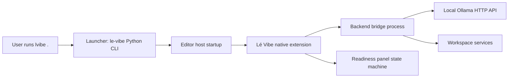

# Lé Vibe Native Extension Boundary (N0-1)

This page defines the first-party native extension boundary so `lvibe .` always lands in a deterministic, actionable agent surface.

## Scope and responsibility split



- Launcher (`le-vibe` Python CLI):
  - Owns environment bootstrapping, editor launch, and deterministic handoff metadata.
  - Does not render chat UI and does not store chat transcripts.
  - Passes extension startup context through explicit, versioned handoff payload.
- Native extension (VS Code extension + panel/commands):
  - Owns user-visible readiness state machine and actionable UX.
  - Owns command surface (`Lé Vibe: Open Agent Surface`, setup/remediation actions).
  - Owns bounded transcript retention policy wiring and privacy controls.
  - Never silently falls back to cloud providers when local runtime is unhealthy.
- Backend bridge (local extension-owned bridge module/process):
  - Owns Ollama health/model probing and prompt/stream transport.
  - Owns workspace-safe context extraction (bounded size, explicit include rules).
  - Returns typed errors mapped to user remediation copy.
  - Writes only local structured logs and bounded transcript artifacts.

## Deterministic startup contract

On activation, the extension resolves exactly one startup state:

1. `checking` (short-lived only)
2. `ready`
3. `needs_ollama`
4. `needs_model`
5. `needs_auth_or_setup`

Rules:
- `checking` must transition to a terminal state (`ready` or one non-ready state).
- Every non-ready state must include at least one direct action and one textual remediation.
- No blank/gray dead-end panel is allowed.

## API boundary: extension <-> backend bridge

Extension consumes this typed interface from the bridge (local IPC or in-process call surface):

```ts
type ReadinessState =
  | "checking"
  | "ready"
  | "needs_ollama"
  | "needs_model"
  | "needs_auth_or_setup";

interface StartupSnapshot {
  state: ReadinessState;
  message: string;
  actions: Array<{ id: string; label: string }>;
  diagnostics?: Record<string, string | number | boolean | null>;
}

interface OllamaModelSummary {
  name: string;
  sizeBytes?: number;
  modifiedAt?: string;
}

interface BridgeApi {
  getStartupSnapshot(): Promise<StartupSnapshot>;
  probeOllamaHealth(): Promise<{ ok: boolean; endpoint: string; errorCode?: string }>;
  listOllamaModels(): Promise<OllamaModelSummary[]>;
  streamPrompt(request: {
    conversationId: string;
    model: string;
    prompt: string;
    contextRefs?: string[];
  }): AsyncIterable<{ type: "token" | "done" | "error"; value: string }>;
  cancelStream(requestId: string): Promise<void>;
}
```

Versioning rule:
- Bridge must expose a semantic version string (`bridgeVersion`) and reject mismatched major versions with explicit `needs_auth_or_setup` remediation.

## API boundary: backend bridge <-> Ollama

Allowed Ollama calls (localhost/default only unless user explicitly configures otherwise):

- `GET /api/tags` for model inventory.
- `POST /api/generate` (streaming) for prompt responses.
- Optional health probe via base URL reachability and tags/generate preflight.

Constraints:
- Default endpoint is local (`http://127.0.0.1:11434`).
- No automatic cloud fallback when probe fails.
- Timeouts and retries must return typed error codes (`OLLAMA_UNREACHABLE`, `MODEL_MISSING`, `REQUEST_TIMEOUT`).

## API boundary: backend bridge <-> workspace services

Bridge may consume workspace services only through explicit methods:

- `resolveWorkspaceRoot()`
- `readFileExcerpt(path, maxBytes, maxLines)`
- `listContextCandidates(globs, limit)`
- `getPolicy(key)` for retention/token-budget policy

Constraints:
- Context reads are bounded by token/byte limits before prompt assembly.
- Paths must resolve under current workspace root unless explicitly allowed by policy.
- Binary files are excluded by default.

## Storage and audit ownership

- Transcript and memory persistence path: `~/.config/le-vibe/`.
- Default policy: rolling retention window + max-size budget with oldest-first compaction and summary stub.
- User controls are required for usage inspection, export, and clear.
- Logs are local structured logs only, opt-in required for any external telemetry.

## Out of scope at N0-1

- Full extension scaffold and command implementation (N1-1).
- Readiness panel runtime wiring (N1-2).
- Actual Ollama streaming integration code (N2+).

